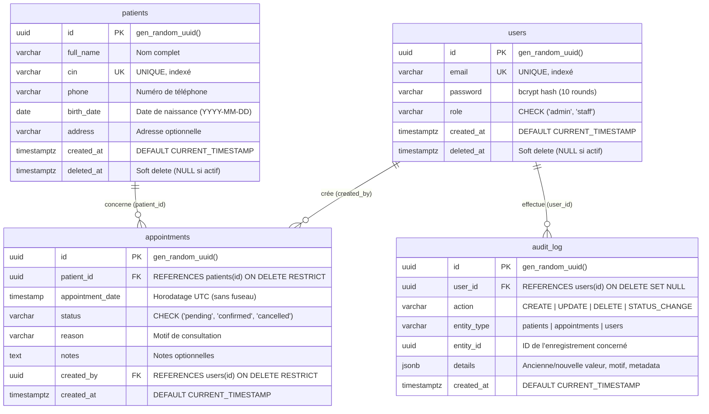

# ClinicFlow — Système de Gestion de Clinique (PERN Stack)

> Application web moderne pour la gestion des patients, rendez-vous et utilisateurs, conçue avec une architecture robuste, une base de données PostgreSQL hautement contrainte, et une interface réactive.

---

## 🚀 Liens Démo en Ligne & Livrables

- **🖥️ Application Frontend (Live Demo) :** [https://clinicflow-7s44.vercel.app](https://clinicflow-7s44.vercel.app)
- **📘 Documentation Interactive Swagger :** [https://clinicflow-eosin.vercel.app/api/docs](https://clinicflow-eosin.vercel.app/api/docs)
- **🐙 Dépôt GitHub :** [https://github.com/hakim-laabad/clinicflow-](https://github.com/hakim-laabad/clinicflow-)
- **🗄️ Base de Données Cloud :** PostgreSQL 16 hébergé sur Neon.tech avec SSL & pooling
- **📦 Archive ZIP de soumission :** Fournie à la racine (`clinicflow-clean.zip`)

---

## 🔑 Comptes de Test (Déjà Initialisés)

| Rôle | Email | Mot de passe | Permissions |
|---|---|---|---|
| **Admin** | `admin@clinicflow.test` | `Admin123!` | Accès complet (CRUD Patients, Suppression, RDV, Dashboard) |
| **Staff** | `staff1@clinicflow.test` | `Staff123!` | Création/Édition Patients & RDV (Suppression interdite) |
| **Staff** | `staff2@clinicflow.test` | `Staff123!` | Création/Édition Patients & RDV (Suppression interdite) |

---

## 1. Conception de la Base de Données (ERD & Justifications)

### 1.1 Schéma Entité-Association (ERD)



### 1.2 Justification des Relations
- **`patients` $\rightarrow$ `appointments` (1-N) :** Un patient peut avoir plusieurs rendez-vous au fil du temps. Un rendez-vous est strictement rattaché à un seul patient. Pas besoin de table de jointure N-N car les consultations sont individuelles.
- **`users` $\rightarrow$ `appointments` (1-N) :** Traçabilité obligatoire : chaque rendez-vous enregistre l'utilisateur (médecin / secrétaire) qui l'a saisi (`created_by`).
- **`users` $\rightarrow$ `audit_log` (1-N) :** Chaque action sensible dans l'application consigne l'auteur pour garantir l'imputabilité.

### 1.3 Règles d'Intégrité & Clés Étrangères
- **Clés primaires :** Type `UUID` avec `gen_random_uuid()`, évitant les attaques par énumération d'ID séquentiels.
- **`ON DELETE RESTRICT` sur les rendez-vous :** Empêche la suppression physique accidentelle d'un patient ou utilisateur ayant des rendez-vous existants (protège l'historique médical).
- **Contraintes `CHECK` :** `role IN ('admin', 'staff')` et `status IN ('pending', 'confirmed', 'cancelled')`.
- **Contraintes `UNIQUE` :** `patients.cin` et `users.email`.
- **Index de Performance :**
  - B-tree sur `patients(cin)` et `users(email)`.
  - Extension `pg_trgm` avec index **GIN** sur `patients(full_name gin_trgm_ops)` et `patients(cin gin_trgm_ops)` pour accélérer les recherches partielles (`ILIKE '%...%'`).
  - B-tree sur `appointments(patient_id)`, `appointments(appointment_date)`, et `appointments(status)`.
  - Index partiel sur `patients(deleted_at) WHERE deleted_at IS NULL` pour optimiser le soft-delete.

### 1.4 Fonctionnalités Bonus de Conception Intégrées
- ✅ **Soft-Delete (`deleted_at`) :** Les patients supprimés ne sont jamais effacés physiquement du disque ; leur date de suppression est horodatée et toutes les requêtes régulières filtrent automatiquement sur `deleted_at IS NULL`.
- ✅ **Table d'Audit Log (`audit_log`) :** Chaque création, mise à jour, suppression ou changement de statut est archivé avec un snapshot `JSONB` des données modifiées.
- ✅ **Garantie GiST d'Anti-Chevauchement :** En plus de la vérification logicielle, une contrainte d'exclusion GiST PostgreSQL (`no_confirmed_overlap`) avec l'extension `btree_gist` empêche au niveau moteur toute collision sous concurrence (race conditions).

---

## 2. Fonctionnalités Obligatoires & Règles Métier

### 2.1 Authentification & Rôles
- **Rôles :** `admin` et `staff`.
- **Authentification :** JWT (JSON Web Token) stocké côté client et vérifié par middleware à chaque requête protégée.
- **Protection par rôle :** Middleware `requireRole('admin')` protégeant les opérations critiques (ex: suppression de patient).

### 2.2 Gestion des Patients
- Champs : `fullName`, `cin` (unique), `phone`, `birthDate`, `address` (optionnel), `createdAt`, `deletedAt`.
- Actions : Création, Consultation détaillée, Modification, Soft-delete (admin uniquement).
- Recherche textuelle tolérante sur le nom ou le CIN avec pagination dynamique (`page`, `limit`).

### 2.3 Gestion des Rendez-vous & Règle Métier des 30 minutes
- Champs : `patientId`, `appointmentDate`, `status` (`pending`, `confirmed`, `cancelled`), `reason`, `notes`, `createdBy`.
- **Règle métier stricte :**
  > Un patient ne peut pas avoir deux rendez-vous **confirmés** à moins de **30 minutes** d'intervalle (avant ou après). Deux rendez-vous espacés d'exactement 30 minutes sont acceptés.
  - La vérification s'exécute à la création d'un rendez-vous avec statut `confirmed`, ainsi que lors d'un passage de statut à `confirmed`.
  - En cas de conflit, l'API rejette l'opération avec un code HTTP `409 Conflict` et un message explicite.
  - Les rendez-vous `pending` et `cancelled` ne sont pas bloqués par cette contrainte.

### 2.4 Dashboard (Statistiques en Temps Réel)
- 4 indicateurs clés :
  1. **Total Patients actifs** (hors soft-deleted).
  2. **Rendez-vous du jour** (basé sur la date UTC courante).
  3. **Rendez-vous en attente (`pending`)**.
  4. **Rendez-vous confirmés (`confirmed`)**.
- Visualisation rapide des prochaines consultations du jour et des derniers patients enregistrés.

---

## 3. Architecture Logicielle & Qualité du Code

Le backend suit une **architecture en couches (Clean N-Tier Architecture)** garantissant séparation des responsabilités et testabilité :

```
Requête HTTP
   │
   ▼
[Routes] ────────► [Zod Validation Middleware] (Validation typée & assainissement)
   │
   ▼
[Controllers] ───► [Middlewares Auth & RBAC] (Vérification JWT & Rôles)
   │
   ▼
[Services] ──────► [Règles Métier] (Fenêtre 30 min, Audit Log, Horodatages UTC)
   │
   ▼
[Repositories] ──► [PostgreSQL Pool] (Requêtes SQL paramétrées contre injections SQL)
```

### Contraintes de Qualité Respectées :
- **Validation stricte :** Schémas Zod sur toutes les entrées utilisateur (`body`, `query`, `params`).
- **Sécurité :** Hashage bcrypt (10 rounds de salt), en-têtes Helmet, CORS configuré avec whitelist.
- **Gestion centralisée des erreurs :** Formats de réponse uniformes `{ success: false, message, errors? }` avec statuts `400`, `401`, `403`, `404`, `409`, `500`.
- **Documentation API vivante :** Spécification OpenAPI / Swagger UI accessible à `/api/docs`.

---

## 4. Documentation des Endpoints REST

| Méthode | Route | Description | Accès |
|---|---|---|---|
| `POST` | `/api/auth/login` | Connexion utilisateur (retourne token JWT + profil) | Public |
| `GET` | `/api/auth/me` | Récupère le profil de l'utilisateur connecté | Authentifié |
| `GET` | `/api/patients` | Liste paginée avec recherche (`?search=&page=&limit=`) | Authentifié |
| `POST` | `/api/patients` | Création d'un nouveau patient | Authentifié |
| `GET` | `/api/patients/:id` | Détails d'un patient et historique de ses rendez-vous | Authentifié |
| `PUT` | `/api/patients/:id` | Modification des informations d'un patient | Authentifié |
| `DELETE` | `/api/patients/:id` | Suppression logique (soft-delete) du patient | **Admin uniquement** |
| `GET` | `/api/appointments` | Liste des rendez-vous filtrable (`?date=&status=`) | Authentifié |
| `POST` | `/api/appointments` | Prise de rendez-vous (vérifie la règle 30 min) | Authentifié |
| `PATCH` | `/api/appointments/:id/status` | Modification du statut (`pending`, `confirmed`, `cancelled`) | Authentifié |
| `GET` | `/api/dashboard/stats` | Métriques globales et statistiques journalières | Authentifié |
| `GET` | `/api/health` | Health-check de l'API et de la connexion DB | Public |
| `GET` | `/api/docs` | Documentation interactive Swagger UI | Public |

---

## 5. Frontend React

- **Framework :** React 18 avec Vite (build ultra-rapide < 1s).
- **Navigation :** React Router v6 avec routes protégées selon l'état d'authentification et les rôles.
- **Gestion d'état :** Context API (`AuthContext`) avec synchronisation `localStorage`.
- **Composants d'interface :**
  - **Login :** Carte moderne avec logo vectoriel, indicateur de chargement et bascule mot de passe masqué/affiché.
  - **Dashboard :** 4 cartes de statistiques, tableau des consultations imminentes et des patients récents.
  - **Liste des Patients :** Recherche en direct, pagination, badge de statut, bouton d'ajout/édition et dialogue de confirmation de suppression.
  - **Détails Patient :** Fiche signalétique complète et historique chronologique de ses rendez-vous.
  - **Rendez-vous :** Filtres par date et statut, création guidée avec sélecteur de patient, mise à jour instantanée du statut.
  - **Modales & Accessibilité :** Rendu via `createPortal` rattaché directement au `document.body` avec blocage du défilement d'arrière-plan (`z-index: 9999`).

---

## 6. Tests Automatisés (Jest + Supertest)

Une suite complète de **19 tests d'intégration** couvre l'ensemble des scénarios critiques :
- Authentification valide et rejet des mauvais identifiants.
- Protection RBAC (rejet du rôle staff sur les routes admin).
- CRUD Patients avec pagination et unicité du CIN.
- **Règle des 30 minutes :**
  - Création de 2 rendez-vous espacés de moins de 30 min $\rightarrow$ `409 Conflict`.
  - Création de rendez-vous espacés d'exactement 30 min $\rightarrow$ `201 Created`.
  - Conflit lors du changement de statut vers `confirmed` $\rightarrow$ `409 Conflict`.
- Soft-delete : invisibilité des enregistrements supprimés dans les listes publiques.
- Exactitude des calculs du dashboard.

---

## 7. Instructions d'Installation & Démarrage Local

### Prérequis
- Node.js 18+ et npm
- PostgreSQL 13+ (ou Docker Desktop)

### Option 1 : Démarrage avec Docker Compose (Recommandé)
Démarre la base de données, l'API Node et le Frontend React en une seule commande :

```bash
docker compose up --build
```
- Frontend : `http://localhost:5173`
- API Backend : `http://localhost:4000`
- Swagger UI : `http://localhost:4000/api/docs`

---

### Option 2 : Installation Manuelle

#### 1. Configuration de la Base de Données
Créez une base de données PostgreSQL locale (ex: `clinicflow`) ou utilisez une instance Neon.

#### 2. Démarrage du Backend
```bash
cd backend
cp .env.example .env
# Renseignez votre DATABASE_URL et JWT_SECRET dans backend/.env

npm install
npm run migrate   # Exécute les migrations (001_init.sql et 002_soft_delete_audit.sql)
npm run seed      # Injecte les données initiales (1 admin, 2 staff, 5 patients, 10 RDV)
npm run dev       # Démarre l'API sur http://localhost:4000
```

#### 3. Démarrage du Frontend
Dans un nouveau terminal :
```bash
cd frontend
npm install
npm run dev       # Démarre l'application React sur http://localhost:5173
```

#### 4. Exécution des Tests Automatisés
```bash
cd backend
npm test          # Lance la suite de 19 tests Jest
```

---

## 8. Données Initiales du Seed (`npm run seed`)

Le script `backend/scripts/seed.js` peuple la base avec :
- **3 Utilisateurs :** 1 Admin (`admin@clinicflow.test`), 2 Staff (`staff1@clinicflow.test`, `staff2@clinicflow.test`).
- **5 Patients réalistes :** Données complètes avec CIN uniques marocains (ex: `AB123456`, `CD789012`).
- **10 Rendez-vous :** Répartition équilibrée de statuts (`confirmed`, `pending`, `cancelled`) avec motifs médicaux variés.

---

## 9. Structure du Répertoire

```
clinicflow/
├── backend/
│   ├── api/index.js                 # Point d'entrée Serverless (Vercel)
│   ├── migrations/                  # Scripts SQL de schéma et contraintes
│   │   ├── 001_init.sql
│   │   └── 002_soft_delete_audit.sql
│   ├── scripts/                     # Scripts de migration et seeding
│   ├── src/
│   │   ├── config/                  # DB pool, Swagger, variables d'environnement
│   │   ├── controllers/             # Contrôleurs HTTP
│   │   ├── middleware/              # Auth JWT, RBAC, Error Handler, Zod validator
│   │   ├── repositories/            # Accès aux données SQL
│   │   ├── routes/                  # Définitions des routes API
│   │   ├── services/                # Logique métier (règle 30 min, audit)
│   │   ├── validators/              # Schémas Zod
│   │   ├── app.js                   # Application Express
│   │   └── server.js                # Serveur HTTP
│   ├── tests/                       # Suite de tests Jest + Supertest
│   ├── Dockerfile
│   └── vercel.json
├── frontend/
│   ├── public/                      # Logo clinique et assets statiques
│   ├── src/
│   │   ├── components/              # Modales, Tableaux, Cartes stats, Layout
│   │   ├── context/                 # AuthContext
│   │   ├── pages/                   # Login, Dashboard, Patients, Details, Appointments
│   │   ├── services/                # Client Axios centralisé
│   │   ├── App.jsx
│   │   └── main.jsx
│   ├── Dockerfile
│   ├── nginx.conf
│   └── vercel.json
├── docs/
│   └── API.md                       # Référence statique de l'API REST
├── docker-compose.yml
└── README.md
```
