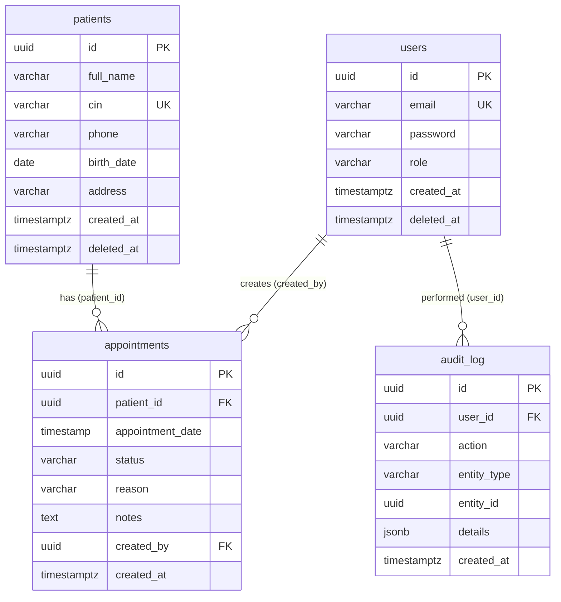

# ClinicFlow

Clinic management app (PERN): patients, appointments, users, roles and a live dashboard.

## Features
- JWT login, `admin` / `staff` roles, role-protected routes (backend enforced)
- Patients CRUD with search (name/CIN), pagination, admin-only delete
- Appointments with status workflow and the **30-minute confirmed-appointment rule**
- Dashboard: total patients, today's appointments, pending, confirmed
- Responsive React UI: sidebar, modals, toasts, skeletons, empty/error states, confirm dialogs
- **Soft delete** for patients (`deleted_at`) — records are never physically removed
- **Audit log** — every create/update/delete/status-change is tracked with user, timestamp and details
- **Swagger / OpenAPI** interactive documentation at `/api/docs`
- **Docker Compose** — one command to start the full stack (backend + frontend + PostgreSQL)
- **19 automated tests** (Jest + Supertest) covering auth, CRUD, business rules and dashboard

## Tech stack
Node.js · Express 4 · PostgreSQL 16 · JWT · bcrypt · Zod · React 18 (Vite) · Jest + Supertest · Swagger/OpenAPI · Docker

## Architecture
```
Route → Validation middleware (Zod) → Controller → Service (business rules) → Repository (SQL, parameterised)
```
Central error handler returns `{ success:false, message }` with 400/401/403/404/409/500. Frontend: pages → hooks/context → `services/api.js` (only place that calls the API).

## Database


### Design justification
- **User → Appointment 1-N**, **Patient → Appointment 1-N**. No N-N needed.
- **User → Audit_log 1-N**: tracks who did what, when and on which entity.
- Both FKs on appointments use `ON DELETE RESTRICT`: history is never silently lost; deleting a patient with appointments returns 409.
- `status` and `role` use **CHECK constraints**. UUIDs via `gen_random_uuid()`.
- Indexes: `cin` (unique), trigram **GIN** on `full_name` and `cin` (fast `ILIKE '%…%'`), `appointments.patient_id`, `appointment_date`, `status`.
- A GiST **exclusion constraint** enforces the 30-minute rule at DB level too (race-condition proof).
- **Soft delete** (`deleted_at`): patients and users are never physically removed; queries filter `WHERE deleted_at IS NULL` with a partial index for performance.

## Business rules
- A patient cannot have two **confirmed** appointments less than 30 minutes apart (before or after). Exactly 30 min apart is allowed.
- Only `confirmed` appointments count; `pending` and `cancelled` never conflict.
- Checked on create (when confirmed) and when changing a status to `confirmed` → **409 Conflict**.
- Appointment times are stored in UTC; the UI converts to local time.
- Patient deletion is a **soft delete** (`deleted_at` timestamp) — data integrity is preserved for audit trail.

## Setup
Requirements: Node 18+, PostgreSQL 13+ (or Docker).

### Option A: Docker (recommended)
```bash
docker compose up --build       # starts postgres + backend + frontend
# App: http://localhost:5173   API: http://localhost:4000   Swagger: http://localhost:4000/api/docs
```

### Option B: Manual
```bash
# 1. Database (Docker option)
docker compose up -d db
# or create it manually: createdb clinicflow   (and clinicflow_test for tests)

# 2. Backend
cd backend
cp .env.example .env            # edit DATABASE_URL / JWT_SECRET
npm install
npm run migrate                 # create tables + audit log
npm run seed                    # 1 admin, 2 staff, 5 patients, 10 appointments
npm run dev                     # http://localhost:4000

# 3. Frontend (new terminal)
cd frontend
npm install
npm run dev                     # http://localhost:5173  (proxies /api to :4000)
```

### Environment variables (`backend/.env`)
| Var | Description |
|---|---|
| `DATABASE_URL` | PostgreSQL connection string |
| `JWT_SECRET` | Long random secret used to sign tokens (never commit) |
| `JWT_EXPIRES_IN` | Token lifetime, default `8h` |
| `PORT` | API port, default `4000` |
| `FRONTEND_URL` | Allowed CORS origin, default `http://localhost:5173` |

Frontend: optional `VITE_API_URL` (defaults to `/api`).

### Tests
```bash
cd backend
cp .env.example .env.test       # point DATABASE_URL to a SEPARATE database (clinicflow_test)
npm test                        # migrates + reseeds the test DB, runs 19 tests
```
> The seed **truncates** tables — never run it against real data. It refuses to run when `NODE_ENV=production`.

## Test credentials (development only)
| Role | Email | Password |
|---|---|---|
| admin | admin@clinicflow.test | Admin123! |
| staff | staff1@clinicflow.test | Staff123! |
| staff | staff2@clinicflow.test | Staff123! |

## API documentation
- **Interactive Swagger UI**: [http://localhost:4000/api/docs](http://localhost:4000/api/docs) (available when backend is running)
- **Static reference**: [`docs/API.md`](docs/API.md)

## Project structure
```
backend/  migrations/  scripts/{migrate,seed}.js  tests/
          src/{config,routes,controllers,services,repositories,middleware,validators,utils}, app.js, server.js
          Dockerfile
frontend/ src/{components,pages,layouts,routes,services,hooks,context,utils,styles}
          Dockerfile  nginx.conf
docs/API.md   docker-compose.yml
```

## Bonus features implemented
| Feature | Details |
|---|---|
| Soft delete (`deleted_at`) | Patients are never physically removed; `WHERE deleted_at IS NULL` filter + partial index |
| Audit log table | Tracks every action (create/update/delete/status_change) with user, entity, timestamp, JSONB details |
| CHECK constraints | `role IN ('admin','staff')`, `status IN ('pending','confirmed','cancelled')` |
| Swagger / OpenAPI | Interactive docs at `/api/docs` with full schema definitions |
| Docker Compose | Full stack: `docker compose up --build` (backend + frontend + postgres) |
| Jest + Supertest | 19 tests: auth, CRUD, business rules, dashboard |

## Future improvements
Refresh tokens / rate limiting on login, user management UI, patient autocomplete for large datasets, calendar view, email/SMS appointment reminders.
